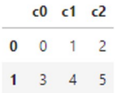
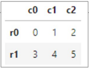
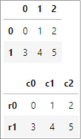

# 出てくるコード
```python
df1 = pd.DataFrame([[0, 1, 2], [3, 4, 5] ],
                  columns=['c0', 'c1', 'c2']) # columns指定してdf作成

df2 = pd.DataFrame([[0, 1, 2], [3, 4, 5]],
                   columns=['c0', 'c1', 'c2'],
                   index=['r0', 'r1']) # colaumns, indexを指定してdf作成

df3.index = ['r0', 'r1'] # indexを'r0', 'r1'に変える

df3.columns = ['c0', 'c1', 'c2'] # columnsを'c0', 'c1', 'c2'に変える

print(type(df)) # dfのデータ型を確認

print(df.shape) # dfの(行数,列数)を表示

display(df)     # dfを表形式で表示

print(df.to_numpy()) # dfをndarrayとしてindex,columnsを除いて取り出したものを表示
```
# Pandas と DataFrame / Series
● Pandas は、表形式(2次元配列) の ndarray と、そこから取り出した行または列(1次元配列) の ndarray を扱うのに便利なクラス(データ型) が用意されている

● 表形式用のクラスを DataFrame、行または列用のクラスを Series と呼ぶ (Seriesについてはcs3-03: データの様子の把握・可視化参照)

# DataFrameとは
● DataFrame は、2次元のndarrayに、行番号 (index) と列ラベル (columns)を付加したもの

● 以下は、2行3列の2次元のndarrayに、行番号 (0, 1) と列ラベル ('c0', 'c1', 'c2')を付加した DataFrame の例


---

# DataFrame の作り方 
pd.DataFrame 関数に2次元リストと columns を設定するためのリストを与えると、DataFrame を簡単に作ることができる 

#### List and DataFrame 

```python
df1 = pd.DataFrame([[0, 1, 2], [3, 4, 5] ],
                  columns=['c0', 'c1', 'c2'])

print(type(df1))
print(df1.shape)
display(df1)
```

**Output:** 
```
<class 'pandas.core.frame.DataFrame'>
(2, 3)
```


ndarrayと同様に、shape属性で、各軸の要素数を取得できる 

---

# display(df) について 
* print関数の代わりにdisplay関数を用いると、DataFrameの index や columns がわかりやすく表示される
* index (行番号)を指定しない場合は自動的に0からの連番が振られる


---

# indexオプション 

indexオプションで行番号を指定することもできる

```python
df2 = pd.DataFrame([[0, 1, 2], [3, 4, 5]],
                   columns=['c0', 'c1', 'c2'],
                   index=['r0', 'r1'])
display(df2)
```

---

# 後からindexとcolumnsを指定 
DataFrameのindex属性とcolumns属性にリストを代入することで、行番号と列ラベルをあとで指定することもできる

```python
df3 = pd.DataFrame([[0, 1, 2], [3, 4, 5]])
display(df3)

df3.index = ['r0', 'r1']
df3.columns = ['c0', 'c1', 'c2']
display(df3)
```


---

# DataFrameの to_numpyメソッド 
DataFrameの to_numpyメソッドで、indexとcolumnsを除いた2次元のndarrayだけ(緑の中)を取り出すことができる

```python
print(type(df3.to_numpy()))
print(df3.to_numpy())
```


**Output:** 
```
<class 'numpy.ndarray'>
[[0 1 2]
 [3 4 5]]
```